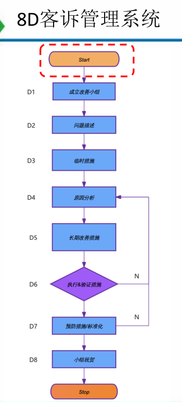
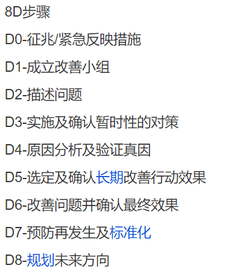
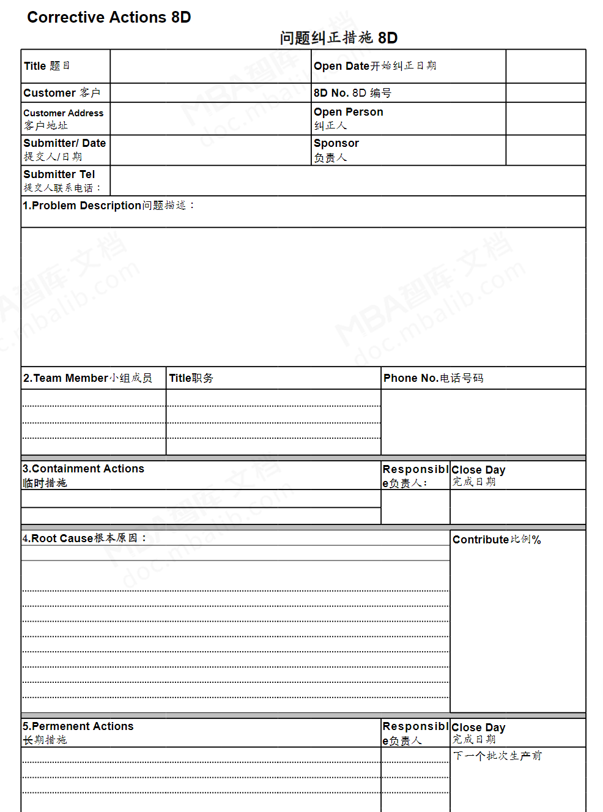
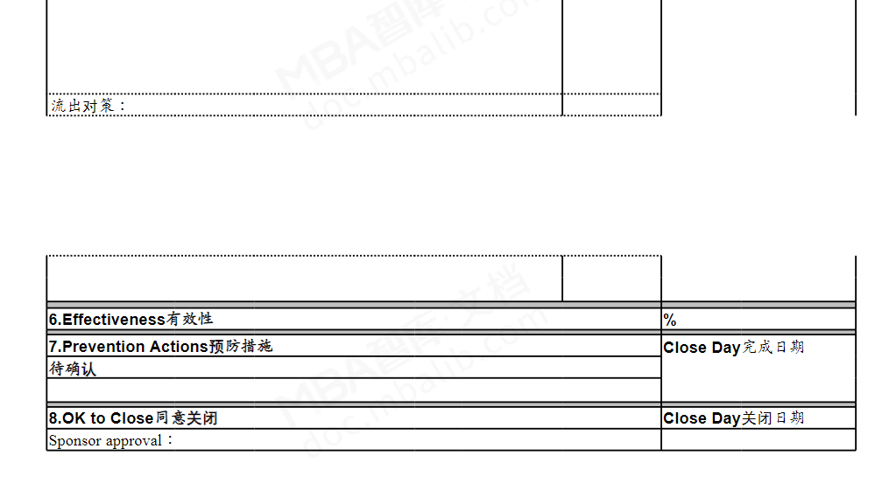
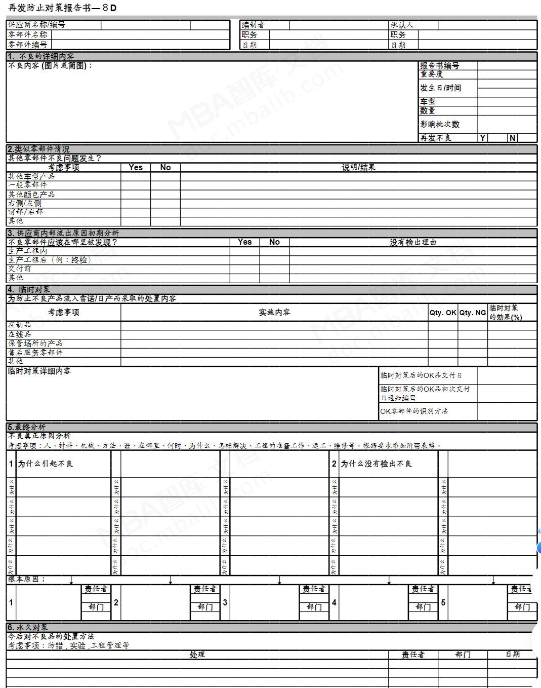
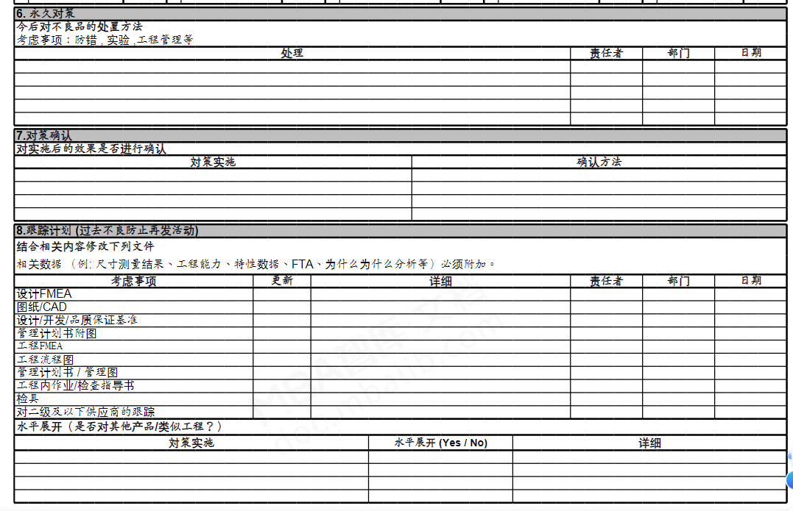

- #8d
	- 开发文档
		- 
		- 
		- 我的文档
			- 总公司-质量管理模块
				- 图片说明
				  collapsed:: true
					- {:height 804, :width 360}
					- 
					-
				- 模版
				  collapsed:: true
					- 问题纠正措施
					  collapsed:: true
						- 
						- 
					- 再发防止对策
					  collapsed:: true
						- 
						- 
				- 开发文档
					-
			- D1-8
				- 概要
					- 当前节点填写人完成后，由审核人指定下一步责任人以及完成时间（考虑到多个负责人填写当前步骤，改审核人分发）
					  background-color:: yellow
						- 问题#question
							- 2-7每一步都可能有多个负责人
							- 审核人、教练、组长、组员、组外人员的权限
								- 审核人
									- 查看全部
								- 教练
									- 查看全部
								- 组长
									- 查看全部
								- 组员
									- 可查看全部，仅编辑责任人部分？
								- 组外人员
									- 仅==查看==由自己发起的？
							- 审核人、教练、组长、发起人的关系
								- 发起人是oms系统中任意人员？
							- 每个责任人完成后，每次都通知审核人？还是所有人完成后再一次性审核？
							- 阶段中有人员替换，通知的时候，是否需要通知原来的人？
					- D6、D7发现异常，审核人可以退回D4
					- 每步分发至责任人后，邮件&企业微信通知；如未完成逾期后，将邮件HL至责任人对应主管
				- D0
					- 发起
				- D1
					- 起草/填写人员
						- 发起人
					- 进入下一步前无需审核
					-
				- D2
					- 起草/填写人员
						- 发起人
					- 审核后进入下一步
				- D3
					- 起草/填写人员
						-
					- 审核后进入下一步
				- D4
					- 起草/填写人员
						-
					- 审核后进入下一步
				- D5
					- 起草/填写人员
						-
					- 审核后进入下一步
				- D6
					- 起草/填写人员
						-
					- 审核后进入下一步
				- D7
					- 起草/填写人员
						-
					- 审核后进入下一步
				- D8
					- 起草/填写人员
						-
					- 审核后进入下一步
			-